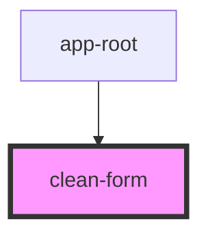

# clean-form

<!-- Auto Generated Below -->

## Properties

| Property           | Attribute            | Description | Type     | Default    |
| ------------------ | -------------------- | ----------- | -------- | ---------- |
| `submitButtonText` | `submit-button-text` |             | `string` | `'Submit'` |

## Events

| Event            | Description | Type               |
| ---------------- | ----------- | ------------------ |
| `telemetryEvent` |             | `CustomEvent<any>` |

## Dependencies

### Used by

 - [app-root](../app-root)

### Graph

----------------------------------------------

*Built with [StencilJS](https://stenciljs.com/)*
