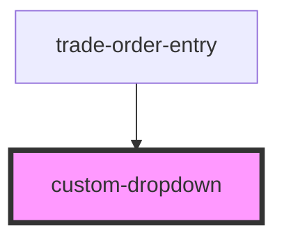

# custom-dropdown

<!-- Auto Generated Below -->

## Properties

| Property  | Attribute | Description | Type       | Default     |
| --------- | --------- | ----------- | ---------- | ----------- |
| `label`   | `label`   |             | `string`   | `undefined` |
| `name`    | `name`    |             | `string`   | `undefined` |
| `options` | --        |             | `string[]` | `undefined` |

## Events

| Event          | Description | Type                                            |
| -------------- | ----------- | ----------------------------------------------- |
| `valueChanged` |             | `CustomEvent<{ name: string; value: string; }>` |

## Dependencies

### Used by

 - [trade-order-entry](../trade-order-entry)

### Graph

----------------------------------------------

*Built with [StencilJS](https://stenciljs.com/)*
