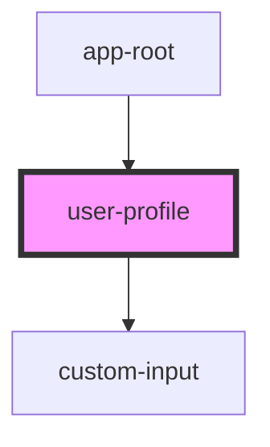

# user-profile

<!-- Auto Generated Below -->

## Properties

| Property      | Attribute | Description | Type          | Default     |
| ------------- | --------- | ----------- | ------------- | ----------- |
| `userId`      | `user-id` |             | `string`      | `undefined` |
| `userService` | --        |             | `UserService` | `undefined` |

## Dependencies

### Used by

 - [app-root](../app-root)

### Depends on

- [custom-input](../custom-input)

### Graph

----------------------------------------------

*Built with [StencilJS](https://stenciljs.com/)*
